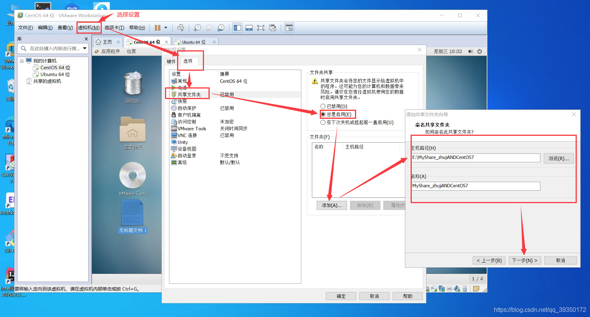
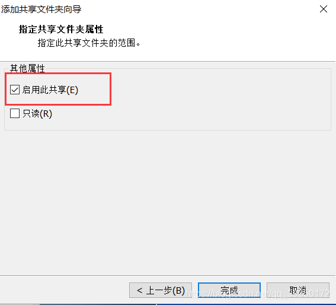
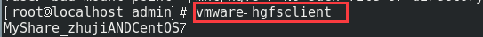
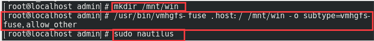
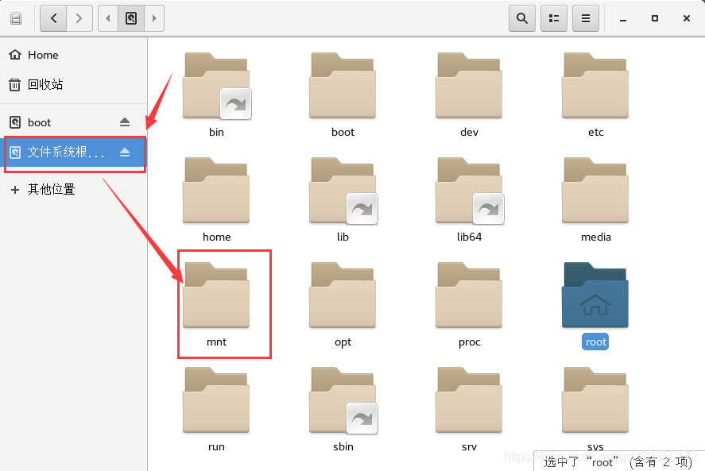
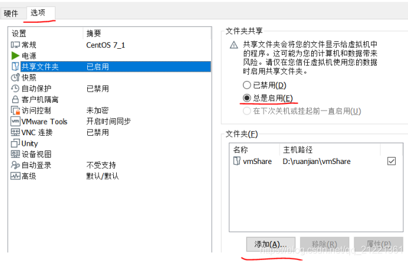
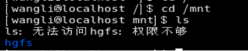
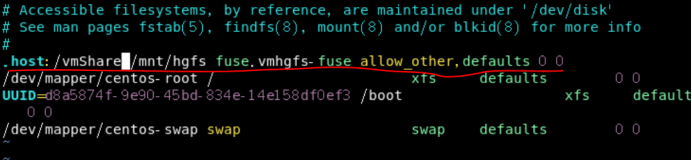
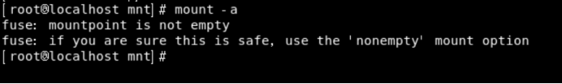

[在VM虚拟机中 CentOS7安装VMware Tools（超级详解）](https://blog.csdn.net/qq_39350172/article/details/110130740)  
[使用vmhgfs-fuse让VMware虚拟机和宿主机共享文件](https://www.jianshu.com/p/7b7ff41fdbc3)  

# 前提条件是有安装vmwaretools
1. 查看是否安装vmwaretools
```sh
[knight@localhost ~]$ vmware-checkvm
VMware software version 6 (good)
[knight@localhost ~]$ vmware-
vmware-checkvm             vmware-rpctool             vmware-vgauth-cmd
vmware-guestproxycerttool  vmware-toolbox-cmd         vmware-vmblock-fuse
vmware-hgfsclient          vmware-user                vmware-xferlogs
vmware-namespace-cmd       vmware-user-suid-wrapper   
```


# 设置windows和centos的共享文件夹(`vmhgfs-fuse .host:/ /mnt/share -o allow_other`)

1. VMware中选择需要共享的文件夹
    
    
2. 在CentOS7中查看这个共享的文件夹：可以用vmware-hgfsclient命令可以看到你的共享文件夹目录，这个命令是你安装了vmwaretools成功后生成的
    
    ```sh
    [knight@localhost ~]$ vmware-hgfsclient 
    deploytools
    ```

1. 新建文件夹`mkdir /mnt/share`
2. 接着`/usr/bin/vmhgfs-fuse .host:/ /mnt/share -o subtype=vmhgfs-fuse,allow_other`
    
    ```
    [root@localhost knight]# mkdir /mnt/share
    [root@localhost knight]# vmhgfs-fuse .host:/ /mnt/share -o allow_other
    ```
    使用如下命令在虚拟机的linux系统中挂载共享目录
    ```
    vmhgfs-fuse .host:/ /mnt/hgfs
    #如果需要普通用户也能使用共享目录，则需使用下面的命令挂载
    vmhgfs-fuse .host:/ /mnt/share -o allow_other
    ```
3. 查看目录，再输入`sudo nautilus`，这个时候基本就可以浏览了，但请注意，这个是root用户下，也必须要在root用户下。当你输入`sudo nautilus`命令时，就出弹出下面这个窗体的。
      

4. 在`/mnt/share`下即可看到共享的文件夹


# centos共享文件夹自动挂载

[VMWare15、Centos7共享文件夹的自动挂载设置（防止关机重启后共享文件夹为空）](https://blog.csdn.net/qq_21221361/article/details/110176257)  

初次设置共享目录， centos7虚拟机共享文件夹默认在/mnt/hgfs（没有手动创建 `mkdir /mnt/hgfs`）共享目录是成功的，有文件；但关机重启后，共享目录是空的。这需要手动挂载共享目录：
1. 手动挂载  
挂载命令：`vmhgfs-fuse .host:/vmShare /mnt/hgfs -o nonempty -o allow_other`  
–vmShar：是设置的共享目录名称；  
/mnt/hgfs：是挂载在虚机的位置  
一定要加allow_other选项，不然之后的hgfs文件普通用户不能访问  
注意要加：-o nonempty，不然报错  
fuse: mountpoint is not empty  
fuse: if you are sure this is safe, use the ‘nonempty’ mount option  
  
  


2. 自动挂载：虚拟机系统每次启动完成，自动挂载虚拟机已经设置的共享目录，方便。  
输入命令：`vim /etc/fstab` 　--打开 /etc/fstab文件，进行识别内容添加
在打开的文件中添加
`.host:/vmShare /mnt/hgfs fuse.vmhgfs-fuse allow_other,defaults 0 0`
`.host:/ /mnt/share fuse.vmhgfs-fuse allow_other,defaults 0 0`

输入:`mount -a` --使刚才设置指令生效



另一种情况
[vmware centos7配置共享文件夹思路](https://www.cnblogs.com/changfengSven/p/7668042.html)  
1. vmware-hgfsclient  查看当前共享目录
2. /usr/bin/vmhgfs-fuse .host:/ /data/WWW -o subtype=vmhgfs-fuse,allow_other 挂载到指定位置   （根据自己情况修改/data/WWW即可）
开机自动挂载：
`echo /usr/bin/vmhgfs-fuse .host:/ /data/WWW -o subtype=vmhgfs-fuse,allow_other >> /etc/rc.local`增加一行命令到`/etc/rc.local`文件最后
`chown +x /etc/rc.d/rc.local`给予执行权限

`/etc/rc.d/rc.local`